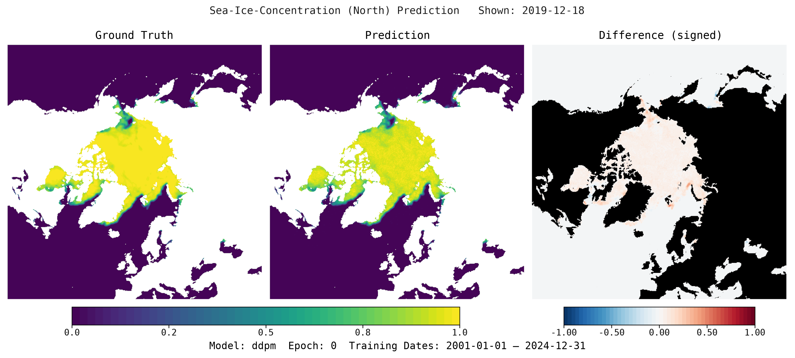

# IceNet Multimodal Pipeline

[](https://github.com/alan-turing-institute/cryocast/actions/workflows/test_code.yaml)
[](https://github.com/alan-turing-institute/cryocast/actions/workflows/build_docs.yml)
[](https://github.com/alan-turing-institute/cryocast/actions/workflows/code_style.yaml)
[](LICENSE)

CryoCast is a **multimodal machine-learning framework for sea-ice forecasting**. It combines satellite observations, Argo float sensor data, and ERA5 reanalysis fields to produce short-term Arctic and Antarctic sea-ice concentration forecasts.

Example forecasts are shown below.

**Arctic**



**Antarctic**


The encode-process-decode architecture translates each input dataset into a shared latent space, allowing new data sources and model components to be added without changing the full pipeline.

## Key capabilities

- Multimodal data fusion across satellite observations, reanalysis fields, and in-situ sensor data.
- Extensible encode-process-decode design for adding new input sources and prediction targets.
- Multiple model configurations, including UNet, vision transformer, diffusion, and persistence-baseline approaches.

## Project context

CryoCast is developed at [The Alan Turing Institute](https://www.turing.ac.uk/) as a research system for Arctic and Antarctic sea-ice forecasting. The current codebase supports research, benchmarking, sensitivity experiments, and case-study analysis; it is not intended for operational forecasting, safety-critical decision making, or public warnings. See the [model card](docs/MODEL_CARD.md) for intended use and scope.

## Quick start

```bash
git clone git@github.com:alan-turing-institute/cryocast.git
cd cryocast
uv sync --managed-python
```

Create a local config in `cryocast/config/` (see [Configuration](https://alan-turing-institute.github.io/cryocast/user-guide/configuration/) for details):

```yaml
# cryocast/config/my.local.yaml
defaults:
  - base
  - _self_

base_path: /path/to/my/data
```

Then download datasets and train:

```bash
uv run imp datasets create --config-name my.local
uv run imp train --config-name my.local
```

Evaluate a checkpoint:

```bash
uv run imp evaluate --checkpoint /path/to/checkpoint.ckpt --config-name my.local
```

## Documentation

See the [project documentation](https://alan-turing-institute.github.io/cryocast/) for the full user guide and reference material.

- [Installation](https://alan-turing-institute.github.io/cryocast/user-guide/installation/) for prerequisites, `uv` setup, and HPC-specific steps
- [Configuration](https://alan-turing-institute.github.io/cryocast/user-guide/configuration/) for local config files, model overrides, and custom datasets
- [Commands](https://alan-turing-institute.github.io/cryocast/user-guide/commands/) for `datasets create`, `datasets inspect`, `train`, and `evaluate`
- [Add a model](https://alan-turing-institute.github.io/cryocast/how-to/add-a-model/) for tensor format and model architecture guidance

## Jupyter notebooks

The `notebooks/` folder contains demonstrator notebooks. Run them with:

```bash
uv run --group notebooks jupyter notebook
```

Start with `notebooks/demo_pipeline.ipynb` for a worked example of the full pipeline.

## Contributing

See [CONTRIBUTING.md](CONTRIBUTING.md) for the development workflow, coding conventions, and test instructions. For project questions, contact [SeaIce@turing.ac.uk](mailto:SeaIce@turing.ac.uk).

## License

CryoCast is released under the [MIT License](LICENSE).
